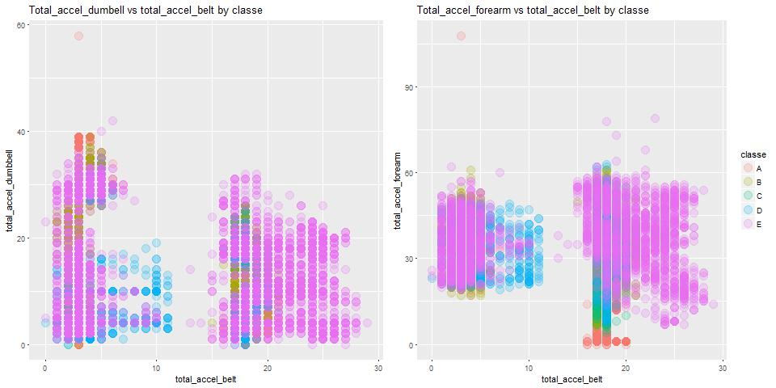

```{r setup, include=FALSE}
knitr::opts_chunk$set(echo = TRUE)
```


#Introduction

Using devices such as Jawbone Up, Nike FuelBand, and Fitbit it is now possible to collect a large amount of data about personal activity relatively inexpensively. These type of devices are part of the quantified self movement - a group of enthusiasts who take measurements about themselves regularly to improve their health, to find patterns in their behavior, or because they are tech geeks. One thing that people regularly do is quantify how much of a particular activity they do, but they rarely quantify how well they do it. More information is available from the website here: http://groupware.les.inf.puc-rio.br/har (see the section on the Weight Lifting Exercise Dataset), and you can download the full paper: ["Qualitative Activity Recognition of Weight Lifting Exercises"](http://groupware.les.inf.puc-rio.br/work.jsf?p1=11201) where you find the most in depth technology and methodology used to build the database used in this document. In this way the authors are thanked [Eduardo Velloso](http://groupware.les.inf.puc-rio.br/collaborator.jsf?p1=evelloso), Bulling, A .; Gellersen, H .; Ugulino, W .; Fuks, H. for sharing such valuable information without any economic interest. 

In this project, the goal is to use data from accelerometers on the belt, forearm, arm, and dumbell of 6 participants to predict how well they do it. We used a Support Vector Machine (SVM) as a supervised algorithm. The model was estimated using the library e1071 that after performing a cross-validation of 5 groups for different parameters of the cost and gamma argument, it was decided that the SVM model with the lowest validation error is with cost = 10 and gamma = 1.

The main result is that when the trained model is used with the test data set from the prediction evaluation, the accuracy is equal to 100%.


#Packages and functions

```{r, eval=FALSE}
library(ggplot2) #To graphs
```

It is also important to mention the multiplot function, created by Cookbook for R, which allows you to create various graphs in a single graph using the ggplot2 graphing system. You will find the function by clicking on: [Cookbook for R - multiplot function](http://www.cookbook-r.com/Graphs/Multiple_graphs_on_one_page_(ggplot2)/).

Also important was the book "Introduction to statistical learning with application in R" to develop the present work, specifically to estimate an SVM using R. In this way, the authors are thanked Gareth James, Daniela Witten, Trevor Hastie and Robert Tibshirani

#Load and preprocess data

The following code allows select features according to accelerometers on the belt, 
forearm, arm and dumbell and outcome feature (classe)

```{r, eval=FALSE}
#Read data sets
bdtraining <- read.csv("pml-training.csv")
bdtest <- read.csv("pml-testing.csv")

#Select features according to accelerometers on the belt, 
#forearm, arm and dumbell and outcome feature
selectVector <- grepl("accel|classe", names(bdtraining))

#New Training data
bdtraining <- bdtraining[,selectVector]

#Investagate features with NAs
NAvector <- sapply(bdtraining, function(x){
        sum(is.na(x))
})

#Selection vector
SeleVec <- NAvector==0

#Elimanate features with NAs
bdtraining <- bdtraining[,SeleVec]


#Select adecuate variables in test data set

#Select features according to accelerometers on the belt, 
#forearm, arm and dumbell and outcome feature
selectVector <- grepl("accel", names(bdtest))

#New Training data
bdtest <- bdtest[,selectVector]

#Investagate features with NAs
NAvector <- sapply(bdtest, function(x){
        sum(is.na(x))
})

#Selection vector
SeleVec <- NAvector==0

#Elimanate features with NAs
bdtest <- bdtest[,SeleVec]

```


#Algorithm selection

The following figure, [plot1], shows two exploratory graphs that allow to decide quickly which supervised algorithm to choose. The one on the left side shows the relationship between two independent variables (total_accel_dumbbell vs total_accel_belt) for each degree in the quality of the execution of the curls (result variable). It is observed that the classifier to be trained must be non-linear, since class E is grouped in different aréas in the plane formed by the two independent variables mentioned above, one or two lines would not be enough to make an adequate classification. In the figure on the right side the same thing happens.

Because it is necessary to create circular and irregular classification zones, we select the supervised algorithm: SVM. This algorithm is adequate to deal with the nonlinear problem that lies ahead.



The following code produces the exploratory chart

```{r, eval=FALSE}
g1 <- ggplot(bdtraining, aes(x=total_accel_belt, y=total_accel_dumbbell,
                       col=classe)) +
        geom_point(alpha = 0.2, lwd = 5)+
        theme(legend.position="none") + 
        ggtitle("Total_accel_dumbell vs total_accel_belt by classe")

g2 <- ggplot(bdtraining, aes(x=total_accel_belt, y=total_accel_forearm,
                             col=classe)) +
        geom_point(alpha = 0.2, lwd = 5) + 
        ggtitle("Total_accel_forearm vs total_accel_belt by classe")

multiplot(g1,g2, cols =2)

```


#Model fit

The **e1071** library was used to estimate a SVM Algorithm. 5-folds cross validation were applied to determine the cost and gamma parameters of the svm function producing the lowest k-fold Cross Validation error rate. You can do this automatically using the tune function of the e1071 library, but it is very expensive computationally since it executes 10-folds cross validation. If you are interested in such automation, the following code produces it.

```{r, eval=FALSE}

tune_output <- tune(svm, classe ~ .,
                    data = bdtraining,
                    kernel = "radial",
                    ranges = list(cost = c(0.01, 0.1, 1, 10, 100),
                                  gamma = c(0.5, 1, 2)))
```

If you want more information on how the tune() function is applied when estimating a SVM see the book: "Introduction to statistical learning with application in R".

Due to the high computational cost, I decided to estimate one SVM for each parameter. If it was done manually since the tune () function could not be executed due to the large number of huge objects being created. The manual form took approximately two hours. The following code shows that the best SVM corresponds to one with cost = 10 and gamma = 1, since it produces the lowest 5-fold Cross Validation Error, iqual to 4.122923

```{r, eval=FALSE}
#Fit SVM algorithm whit Cost = 10
#and gamma 1
set.seed(4621)
svmfit <- svm(classe ~ ., data = bdtraining,
               kernel="radial", cost = 10, gamma=1,
               scale = TRUE,
               cross = 5)

#K fold CV error = 4.122923
100 - svmfit$tot.accuracy

```

#Error test (Quiz prediction)

When evaluating the SVM by training in the test database, bdtest, the following predictions are produced: 

```{r, echo=FALSE, message=FALSE, warning=FALSE}
bd <- data.frame(Observation_from_bdtest = c(1:20), 
                 Prediction = c("B", "A", "B", "A",
                                "A", "E", "D", "B",
                                "A", "A", "B", "C",
                                "B", "A", "E", "E",
                                "A", "B", "B", "B"))
library(knitr)
kable(bd)
```

The precision in the prediction is equal to 100%. Use this algorithm in the quiz and you will earn it. :)

The follow code produce predictions:

```{r, eval=FALSE}
predict(svmfit,newdata = bdtest)

```


